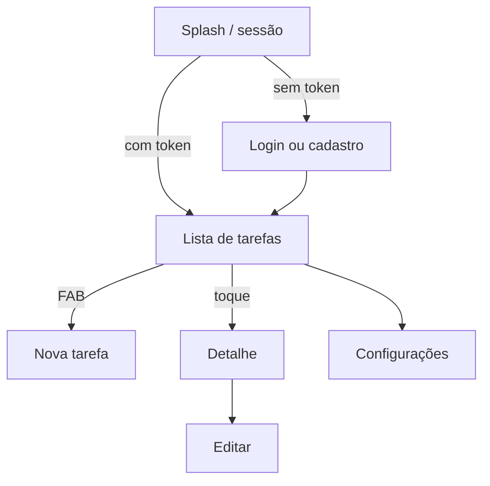

# Taskle

Lista de tarefas full-stack: cadastro, login e CRUD de tarefas privadas por usuário. Front-end **Flutter**; API **.NET 10 Minimal API** com **SQLite**, **JWT + refresh token** e documentação via **Scalar**.

## Sobre o projeto

| Camada | Tecnologia | Descrição |
|--------|------------|-----------|
| App | Flutter 3.13+ | Auth, lista de tarefas, criar/editar/excluir, configurações |
| API | .NET 10 Minimal API | REST com JWT; tarefas escopadas ao usuário logado |
| Banco | SQLite + EF Core | Migrations automáticas na subida; `taskle.db` |

## Estrutura do monorepo

```
taskle/
├── TaskleBackend/     → [README do backend](TaskleBackend/README.md)
└── taskle-app/        → [README do app](taskle-app/README.md)
```

Documentação complementar:

| Documento | Conteúdo |
|-----------|----------|
| [`taskle-app/README.md`](taskle-app/README.md) | Arquitetura Flutter, testes, coverage, screenshots |
| [`TaskleBackend/README.md`](TaskleBackend/README.md) | Pacotes, migrations, execução e URLs da API |

## Pré-requisitos

- [.NET 10 SDK](https://dotnet.microsoft.com/download)
- [Flutter 3.13+](https://flutter.dev/docs/get-started/install)

## Quick start

### 1. Backend

```bash
cd TaskleBackend
dotnet run
```

A API REST sobe em `http://localhost:5062/api/v1`. O banco é criado/atualizado automaticamente via EF Core migrations (`Database.Migrate()` na inicialização).

Para migrations, pacotes e Scalar, consulte [`TaskleBackend/README.md`](TaskleBackend/README.md).

### 2. App Flutter

```bash
cd taskle-app
flutter pub get
flutter run
```

> O backend deve estar em execução antes de autenticar ou gerenciar tarefas.

Para arquitetura, testes e coverage, consulte [`taskle-app/README.md`](taskle-app/README.md).

## Integração app ↔ API

Base URL em `taskle-app/lib/src/common/constants/api_constant.dart`:

| Plataforma | URL |
|------------|-----|
| Web / Desktop / iOS | `http://localhost:5062/api/v1` |
| Android Emulator | `http://10.0.2.2:5062/api/v1` |

Scalar: `http://localhost:5062/scalar` · OpenAPI: `http://localhost:5062/openapi/v1.json`

## Funcionalidades

### Autenticação
- Cadastro, login, refresh token e sessão
- ViewModels: login, registro e sessão

### Tarefas
- Listagem apenas das tarefas do usuário autenticado
- Criar, editar, marcar como concluída e excluir

### Configurações
- Tema escuro persistido
- About e acesso pela AppBar da lista

## Fluxo do usuário



1. Abra o app; a sessão é verificada
2. Cadastre-se ou faça login, se necessário
3. Veja suas tarefas; marque concluídas pelo checkbox
4. Crie ou edite tarefas pelo FAB ou detalhe
5. Ajuste tema em Configurações

## Examples of commits

```
git add . && git commit -m ":rocket: Initial commit." && git push
git add . && git commit -m ":building_construction: Added initial project architecture." && git push
git add . && git commit -m ":building_construction: Update project architecture." && git push
git add . && git commit -m ":memo: Updated project documentation." && git push
git add . && git commit -m ":memo: Updated code documentation." && git push
git add . && git commit -m ":white_check_mark: Added feature xyz." && git push
git add . && git commit -m ":wrench: Fixed xyz usage." && git push
git add . && git commit -m ":heavy_minus_sign: Removed xyz." && git push
git add . && git commit -m ":memo: Adjusted project imports." && git push
git add . && git commit -m ":arrow_up: Updated dependencies." && git push
git add . && git commit -m ":arrow_down: Removed dependencies." && git push
git add . && git commit -m ":wastebasket: Removed unused code." && git push
git add . && git commit -m ":test_tube: Added test functionality xyz." && git push
git add . && git commit -m ":construction_worker: Building in progress." && git push
git add . && git commit -m ":construction_worker: Added CI build system." && git push
```

## License

[MIT License](https://opensource.org/licenses/MIT)

Copyright (c) 2026 William Franco.
