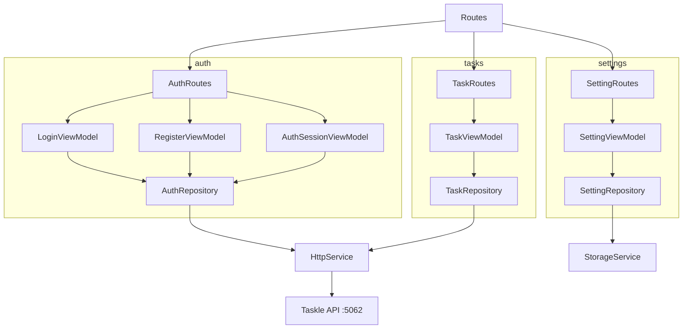

# Taskle App

Flutter client for the Taskle backend (JWT auth, private task CRUD, settings). Auth, tasks, and settings live in separate feature modules with MVVM-style view models (`abstract interface` + `*Impl` extending `StateManagement`). Auth is split into Login, Register, and Session view models; repositories call the REST API at **`http://localhost:5062/api/v1`**. No MobX; flat models under `features/*/models/` with `StatePattern` and `ResultPattern`.

## Structure



## Stack

| Technology | Version |
|------------|---------|
| Dart SDK | ^3.13.4 |
| connectivity_plus | ^7.1.1 |
| dio | ^5.9.2 |
| get_it | ^9.2.1 |
| go_router | ^17.2.3 |
| shared_preferences | ^2.5.5 |
| flutter_lints | ^6.0.0 |
| build_runner | ^2.15.0 |
| mockito | ^5.6.4 |
| Android Gradle Plugin | 9.1.0 |
| Kotlin | 2.4.0 |
| NDK | 30.0.16248370 |
| compileSdk / targetSdk | 36 |
| minSdk | 29 |
| JVM | 25 |
| iOS Deployment Target | 15.0 |
| Swift | 5.0 |

## Architecture

```
src/
    ├── common/
    │   ├── constants/
    │   ├── dependency_injectors/
    │   ├── extensions/
    │   ├── patterns/
    │   ├── routes/
    │   ├── services/
    │   ├── state_management/
    │   └── widgets/
    └── features/
        ├── auth/
        ├── tasks/
        └── settings/
```

## Settings

- Dark theme persisted in `SharedPreferences`
- About screen
- Settings icon on tasks AppBar

## Coverage

```
flutter pub run build_runner build --delete-conflicting-outputs
flutter test --coverage
genhtml coverage/lcov.info -o coverage/html
open coverage/html/index.html
```

## ScreenShots

Placeholder paths — add PNG files under `assets/screenshots/` when available.

| Image 1 | Image 2 | Image 3 |
|----------|----------|----------|
|  |  |  |

## Commits

```
git add . && git commit -m ":rocket: Initial commit." && git push
git add . && git commit -m ":building_construction: Added initial project architecture." && git push
git add . && git commit -m ":memo: Updated project documentation." && git push
```

## License

[MIT License](https://opensource.org/licenses/MIT)

Copyright (c) 2026 William Franco.
